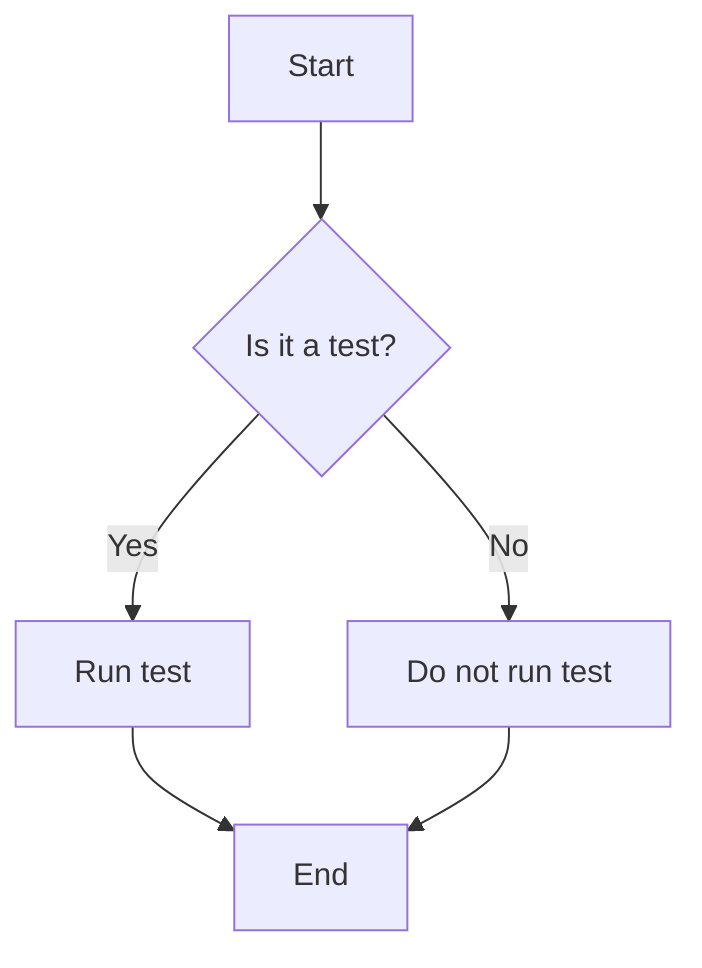

# Hello World

Here is the first post of the blog. This is a test post to see how the blog works.

## Introduction
Extension Settings
The following settings are supported:

yaml.yamlVersion: Set default YAML spec version (1.2 or 1.1)
yaml.format.enable: Enable/disable default YAML formatter (requires restart)
yaml.format.singleQuote: Use single quotes instead of double quotes
yaml.format.bracketSpacing: Print spaces between brackets in objects
yaml.format.proseWrap: Always: wrap prose if it exceeds the print width, Never: never wrap the prose, Preserve: wrap prose as-is
yaml.format.printWidth: Specify the line length that the printer will wrap on
yaml.validate: Enable/disable validation feature
yaml.hover: Enable/disable hover
yaml.completion: Enable/disable autocompletion
yaml.schemas: Helps you associate schemas with files in a glob pattern
yaml.schemaStore.enable: When set to true, the YAML language server will pull in all available schemas from JSON Schema Store
yaml.schemaStore.url: URL of a schema store catalog to use when downloading schemas.
yaml.customTags: Array of custom tags that the parser will validate against. It has two ways to be used. Either an item in the array is a custom tag such as "!Ref" and it will automatically map !Ref to a scalar, or you can specify the type of the object !Ref should be, e.g. "!Ref sequence". The type of object can be either scalar (for strings and booleans), sequence (for arrays), mapping (for objects).
yaml.maxItemsComputed: The maximum number of outline symbols and folding regions computed (limited for performance reasons).
yaml.disableDefaultProperties: Disable adding not required properties with default values into completion text (default is false).
yaml.suggest.parentSkeletonSelectedFirst: If true, the user must select some parent skeleton first before autocompletion starts to suggest the rest of the properties. When the YAML object is not empty, autocompletion ignores this setting and returns all properties and skeletons.
[yaml]: VSCode-YAML adds default configuration for all YAML files. More specifically, it converts tabs to spaces to ensure valid YAML, sets the tab size, allows live typing autocompletion and formatting, and also allows code lens. These settings can be modified via the corresponding settings inside the [yaml] section in the settings:
editor.tabSize
editor.formatOnType
editor.codeLens
http.proxy: The URL of the proxy server that will be used when attempting to download a schema. If it is not set or it is undefined no proxy server will be used.
http.proxyStrictSSL: If true the proxy server certificate should be verified against the list of supplied CAs. Default is false.
yaml.style.flowMapping : Forbids flow style mappings if set to forbid
yaml.style.flowSequence : Forbids flow style sequences if set to forbid
yaml.keyOrdering : Enforces alphabetical ordering of keys in mappings when set to true. Default is false
yaml.extension.recommendations : Enable extension recommendations for YAML files. Default is true

